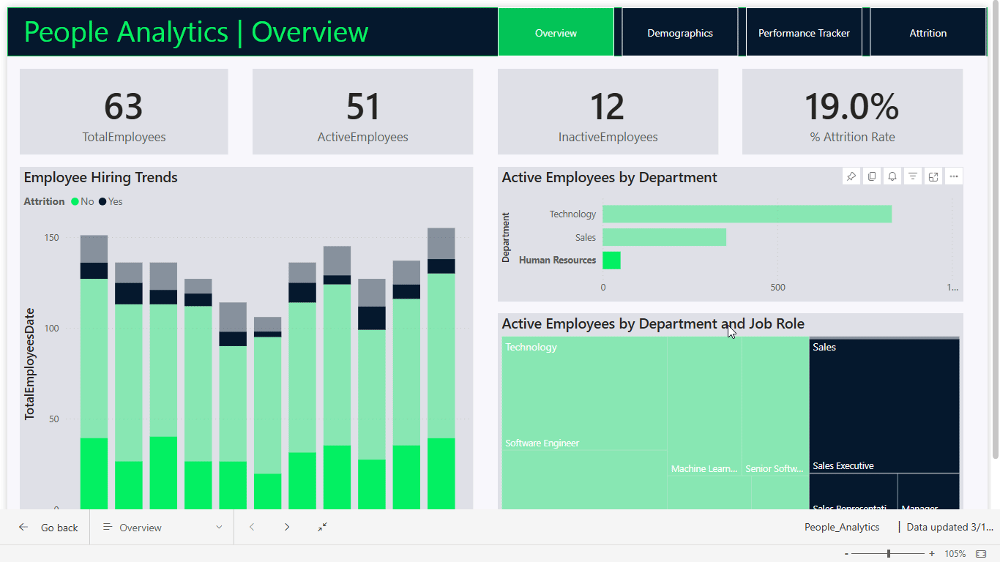

# 👥 Workforce-Navigator-Data-Driven-HR-Decisions

## Project Overview
This project focused on analyzing employee data for a software company, aiming to uncover workforce trends and dive deeper into employee attrition patterns. The goal was to identify key factors influencing turnover and provide HR stakeholders with actionable insights through a comprehensive Power BI report.

## Here's a Glimpse of the Dashboard

## Why This Matters
Employee attrition is a major concern for organizations, especially in fast-paced and competitive industries like technology. By understanding **who is leaving, why they are leaving, and which factors contribute to attrition**, HR teams can craft more effective **retention strategies**, enhance employee engagement, and foster a stronger organizational culture.

## Approach & Process

### Data Preparation
- Imported, cleaned, and transformed raw HR data into **Power BI**.
- Created a **well-structured data model** to support analytical queries and filtering across key employee attributes.

### Analysis & Calculations
- Performed **exploratory data analysis (EDA)** to uncover workforce composition, tenure distributions, and performance trends.
- Developed **custom DAX measures** to calculate attrition rates across departments, roles, performance bands, and tenure groups.
- Used segmentation techniques to identify **high-risk employee segments** and potential attrition triggers.

### Report Design
- Built **multi-page, interactive reports** using Power BI, designed for HR leadership.
- Applied advanced **visual storytelling techniques**, ensuring the report delivered clear insights and allowed users to independently explore trends and drill down into key areas.
- Created a **branded, user-friendly layout**, ensuring the report was both **insightful and visually appealing** for non-technical stakeholders.

### Delivery & Impact
- Delivered a final, **executive-ready Power BI report** that served as both a **diagnostic tool** and a **strategic guide** for HR leadership.
- Equipped the HR team with **data-driven insights** to enhance retention strategies, improve workforce planning, and proactively address talent risks.

---

## Key Takeaways
This project offered a valuable opportunity to combine **data analysis expertise with design thinking**, ensuring that the insights didn’t just highlight trends but actively **guided HR decision-making**. By turning complex employee data into a clear, actionable story, the final report empowered HR leaders to move beyond intuition and make **evidence-based decisions** to reduce attrition and enhance employee satisfaction.
